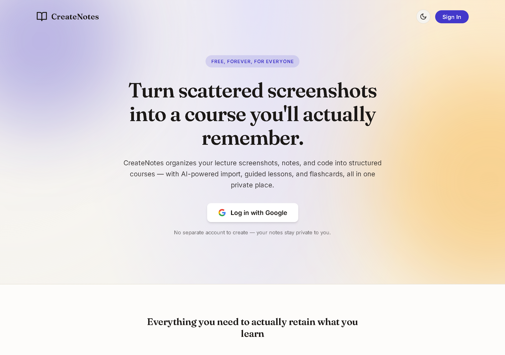
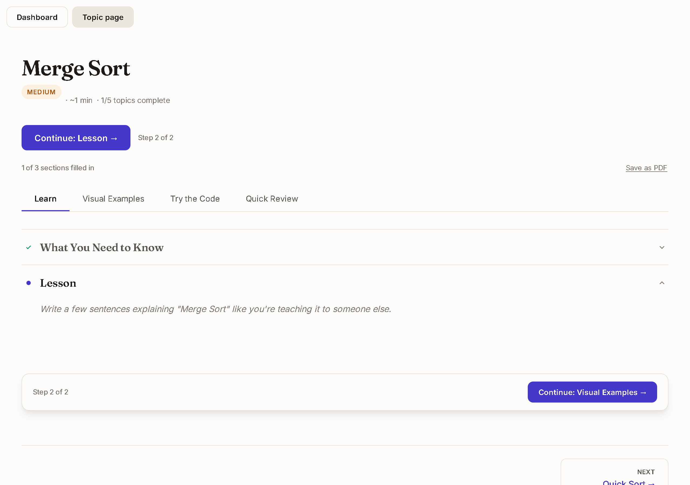
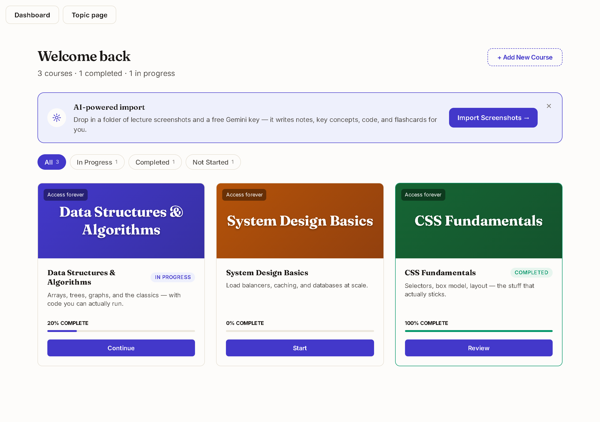

# CreateNotes

**Turn a folder of lecture screenshots into a course you'll actually study — automatically.**

## What it is

You take screenshots during a lecture, a tutorial, a course video. They pile up in a folder and never turn into anything you actually study from.

CreateNotes fixes that: drop the screenshots in, and it builds a real course out of them — organized into courses → modules → topics, with notes, key concepts, code, and flashcards written for you. Free, and it stays private to your account.

## The AI import

This is the core of it. Paste a free Gemini API key, pick (or skip) a module name, and drop in a folder of screenshots.

- It **groups** the screenshots into topics by concept — hand it a whole messy lecture dump and it figures out where one topic ends and the next begins.
- It **writes** the key concepts, a plain-language lesson, and any code shown, for every topic.
- It **generates flashcards** for quick review afterward.
- The API key is never stored — it's used for that one import and discarded.

## Studying a topic

Every topic walks you through the same four steps:

1. **Learn** — key concepts, then a full lesson, one step at a time
2. **Visual Examples** — the original screenshots, right next to the notes they came from
3. **Try the Code** — a real code editor, with an expected-output panel you can reveal when you're ready to check your work
4. **Quick Review** — flip through the flashcards

Your progress isn't something you have to manage — it's tracked automatically from what you've actually filled in, both on the topic itself and back on your dashboard.

## Your dashboard

Every course you own, how far into each one you are, and one click back into whichever you left off on.

## Everything else

- **Google sign-in** — no separate account, no password to lose
- **Private by default** — your courses are yours; nobody else can see them
- **Dark mode**, and it works properly on a phone
- **Export code to Git** — pull any topic's code out to a local folder as its own commit
- **Free**, with no catch — the AI import runs on your own free-tier Gemini key

## Try it

Open the app, sign in with Google, and either add a course by hand or hit **Import Screenshots** to let the AI build one for you from a folder of images. A free Gemini key takes about a minute to grab at [aistudio.google.com/apikey](https://aistudio.google.com/apikey).

---

If this is useful to you, a ⭐ on the repo goes a long way — and if you build on it or spot something worth fixing, PRs are welcome.
